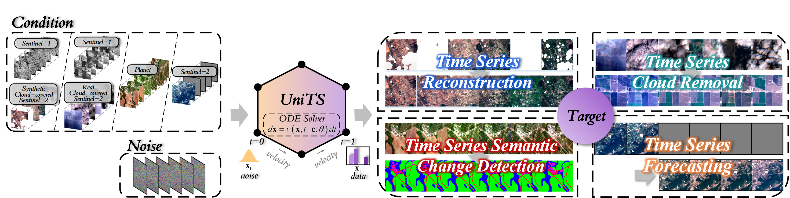
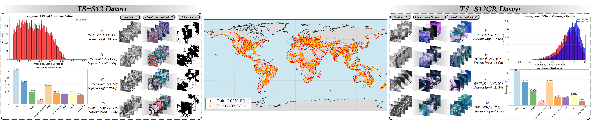
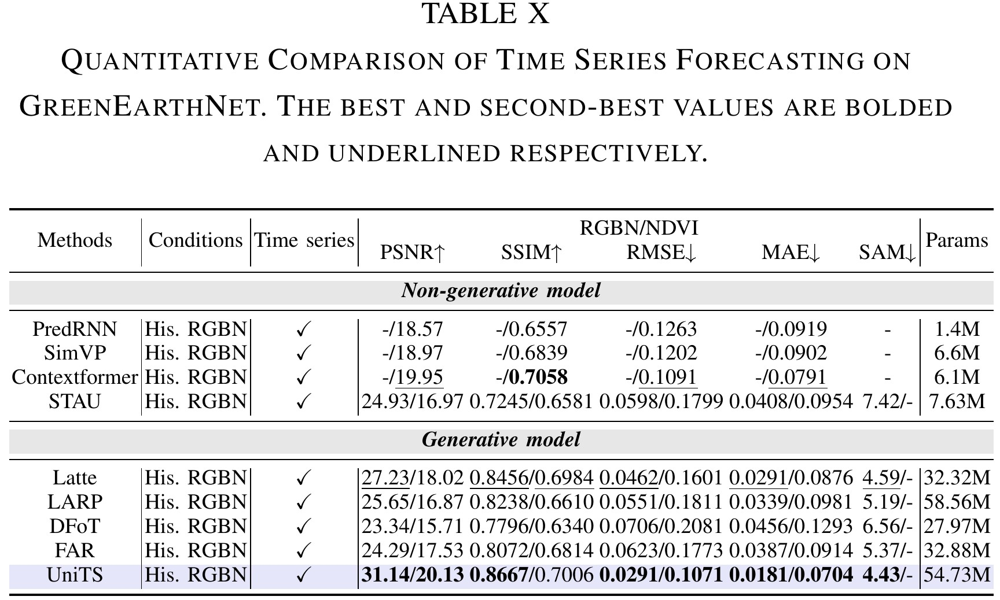

<p align="center">
    
<p>

<h1 align="center"><a href="https://arxiv.org/" style="color:#9C276A">
UniTS: Unified Time Series Generative Model for Earth Observation</a></h1>
<h4 align="center"> If our project helps you, please give us a star ⭐ on GitHub to support us.</h4>

<div align="center">

<!-- # ⚡️UniTS⚡️ -->

[[Paper 📰]](https://arxiv.org/) [[Project Page ✨]](https://yuxiangzhang-bit.github.io/UniTS-website/) 
<!-- [[miniFLUX Model 🚀]](https://huggingface.co/rain1011/pyramid-flow-miniflux) [[SD3 Model ⚡️]](https://huggingface.co/rain1011/pyramid-flow-sd3) [[demo 🤗](https://huggingface.co/spaces/Pyramid-Flow/pyramid-flow)] -->

</div>
<!-- <h5 align="center">

[](https://huggingface.co/spaces/lixin4ever/VideoLLaMA3-Image)
[](https://huggingface.co/spaces/lixin4ever/VideoLLaMA3)
[](https://huggingface.co/collections/DAMO-NLP-SG/videollama3-678cdda9281a0e32fe79af15) <br>
[](https://github.com/DAMO-NLP-SG/VideoLLaMA3/blob/main/LICENSE) 
[](https://hits.seeyoufarm.com)
[](https://github.com/DAMO-NLP-SG/VideoLLaMA3/issues?q=is%3Aopen+is%3Aissue)
[](https://github.com/DAMO-NLP-SG/VideoLLaMA3/issues?q=is%3Aissue+is%3Aclosed)  <br>
[](https://huggingface.co/papers/2501.13106)
[](https://arxiv.org/abs/2501.13106) 
</h5> -->


</p></details>


## 📰 News
* **[2025.11.30]**  👋👋 Release paper of UniTS. If you have works closely related to UniTS not mentioned in the paper, feel free to let us know.

## 🌟 Introduction
UniTS is a general generative framework applicable to various time series tasks, including ***time series reconstruction***, ***time series cloud removal***, ***time series semantic change detection***, and ***time series forecasting***. This method adopts a generation paradigm based on flow matching, and its core architecture consists of a Diffusion Transformer integrated with spatio-temporal blocks.


We sampled tens of thousands of ROIs worldwide to construct two benchmark datasets, TS-S12 and TS-S12CR, which serve as important benchmarks for evaluating the performance of time series cloud removal and forecasting tasks in real-world scenarios.



<details>
  <summary>💡Click here to show detailed performance on time series reconstruction</summary>
  
</details>

<details>
  <summary>💡Click here to show detailed performance on time series cloud removal</summary>
  
</details>

<details>
  <summary>💡Click here to show detailed performance on time series semantic change detection</summary>
  
  
</details>

<details>
  <summary>💡Click here to show detailed performance on time series forecasting</summary>
  
  
</details>

## 🛠️ Requirements and Installation

Basic Dependencies:

* Python: 3.11.11
* Pytorch: 2.4.0+cu121
* timm: 1.0.15
* torchdiffeq: 0.2.5

<!-- Install required packages:

**[Inference-only]**

For stable inference, install the following package versions:

```bash
# PyTorch and torchvision for CUDA 11.8
pip install torch==2.4.0 torchvision==0.19.0 --extra-index-url https://download.pytorch.org/whl/cu118

# Flash-attn pinned to a compatible version
pip install flash-attn==2.7.3 --no-build-isolation --upgrade

# Transformers and accelerate
pip install transformers==4.46.3 accelerate==1.0.1

# Video processing dependencies
pip install decord ffmpeg-python imageio opencv-python
```
> ⚠ **Note:** For CUDA 11.8 with `torch==2.4.0` and `torchvision==0.19.0`, use `flash-attn==2.7.3`.  
> If you are using a different Python or CUDA version, please check the [flash-attn releases](https://github.com/Dao-AILab/flash-attention/releases/) to select the compatible wheel. Using incompatible versions may break the setup.

**[Training]**

```bash
git clone https://github.com/DAMO-NLP-SG/VideoLLaMA3
cd VideoLLaMA3
pip install -r requirements.txt
pip install flash-attn --no-build-isolation
``` -->

## 📦 Model Zoo (coming soon)

| Model                | Task (Dataset)  | Checkpoint Link                                                      |
| -------------------- | ------------ | ------------------------------------------------------------ |
| UniTS       | Time Series Reconstruction (TS-S12)  | [🤗 UniTS_Reconstruction](https://huggingface.co) |
| UniTS       | Time Series Cloud Removal (TS-S12CR) | [🤗 UniTS_Cloud_Removal](https://huggingface.co) |
| UniTS | Time Series Semantic Change Detection (DynamicEarthNet)   | [🤗 UniTS_Semantic_Change_Detection_Dync](https://huggingface.co) |
| UniTS | Time Series Semantic Change Detection (MUDS)  | [🤗 UniTS_Semantic_Change_Detection_MUDS](https://huggingface.co) |
| UniTS | Time Series Forecasting (TS-S12)| [🤗 UniTS_Forecasting_TS-S12](https://huggingface.co) |
| UniTS | Time Series Forecasting (GreenEarthNet)| [🤗 UniTS_Forecasting_GreenEarth](https://huggingface.co) |

## :earth_americas: Dataset

| Dataset                | Task   | Checkpoint Link                                                      |
| -------------------- | ------------ | ------------------------------------------------------------ |
| TS-S12       | Time Series Reconstruction & Forecasting (TS-S12)  | [🤗 TS-S12](https://huggingface.co/datasets/YuxiangZhang-BIT/UniTS-Datasets-ckpt/tree/main/TS-S12) |
| TS-S12CR       | Time Series Cloud Removal | [🤗 TS-S12CR](https://huggingface.co/datasets/YuxiangZhang-BIT/UniTS-Datasets-ckpt/tree/main/TS-S12CR) |
| Land cover map       | Class-level evaluation for TS-S12 and TS-S12CR | [🤗 Land cover map](https://huggingface.co/datasets/YuxiangZhang-BIT/UniTS-Datasets-ckpt/tree/main) |

- TS-S12 dataset directory (**1.5T**)
```bash
TS-S12/
├── data_s1_s2/          # Sentinel-1 & 2 for each ROI, 256×256 patch size
│   ├── roi851_s1_f39.h5 # roi{ROI}_s1_f{sequence lengths}.h5
│   ├── roi851_s2_f39.h5 # roi{ROI}_s2_f{sequence lengths}.h5 | cloud-free Sentinel-2
│   └── ...
├── cldmsk/              # All annual cloud masks for each ROI
│   ├── roi851_cldmsk.h5 # roi{ROI}_cldmsk.h5
│   └── ...
└── splits/
    ├── train.txt
    └── test.txt
```
- TS-S12CR dataset directory (**767G**)
```bash
TS-S12CR/
├── data_s1_s2/                # Sentinel-1 & 2 for each ROI, 256×256 patch size
│   ├── roi2434_s1_f46.h5      # roi{ROI}_s1_f{sequence lengths}.h5
│   ├── roi2434_s2_f46_wcld.h5 # roi{ROI}_s2_f{sequence lengths}_wcld.h5 | cloud-cover Sentinel-2
│   ├── roi2434_s2_f46.h5      # roi{ROI}_s2_f{sequence lengths}.h5 | cloud-free Sentinel-2
│   └── ...
└── splits/
    ├── train.txt
    └── test.txt
```
- Land cover map directory (**45G**)
```bash
land_cover_map/ 
├── roi851_s2_f39.h5 
├── roi2434_s2_f46.h5
└── ...
```
- Time Series Semantic Change Detection dataset is provided by [SitsSCD
](https://github.com/ElliotVincent/SitsSCD?tab=readme-ov-file) | [DynamicEarthNet](https://drive.google.com/file/d/1cMP57SPQWYKMy8X60iK217C28RFBkd2z/view), [MUDS](https://drive.google.com/file/d/1RySuzHgQDSgHSw2cbriceY5gMqTsCs8I/view)
```bash
DynamicEarthNet/
├── train/                
│   └── 1311_3077_13/      # ROI
│       ├── 1311_3077_13_0_infra.jpeg
│       ├── 1311_3077_13_0_rgb.jpeg
│       └── ...
├── val/
│   ├── 1973_3709_13/
│   └── ...
├── test/
│   ├── 1286_2921_13/
│   └── ...
├── labels/
│   ├── 1311_3077_13.npy
│   └── ...
└── split.json
```

- Time Series Forecasting ([GreenEarthNet](https://github.com/vitusbenson/greenearthnet), [EarthNet Toolkit](https://github.com/earthnet2021/earthnet-toolkit), [earthnet_models_pytorch](https://github.com/earthnet2021/earthnet-models-pytorch))

GreenEarthNet Dataset Download
```bash
pip install earthnet
import earthnet as en
en.download(dataset = "earthnet2021x", split = "train", save_directory = "data_dir")
en.download(dataset = "earthnet2021x", split = "iid", save_directory = "data_dir")
```

The script for constructing the dataset in GreenEarthNet is ```earthnet_models_pytorch/data/en21x_data.py```. In the `en21x_data.py` script, loading data requires executing multi-modal preprocessing operations each time, resulting in significant time overhead. To address this, we preprocess all modal data uniformly and convert it into h5 format for storage. During subsequent training of the UniTS model, the preprocessed data is loaded directly from the h5 files.
```
python data/save_GreenEarthNet_h5.py --root root --data_path data_path --save_path save_path --num_threads 4
```
```bash
GreenEarthNet/
├── train_h5/                
│   └── 29SND/      # ROI
│       ├── 29SND_2017-06-10_2017-11-06_2105_2233_2873_3001_32_112_44_124.h5
│       └── ...
└── iid_h5/
    ├── 29SND/
    └── ...
```

## 🔥 Training
Coming soon...

## 📈 Evaluation
Coming soon...


## 📑 Citation

If you find UniTS useful for your research, please cite using this BibTeX:

```bibtex
@article{,

}


```

## 👍 Acknowledgement

